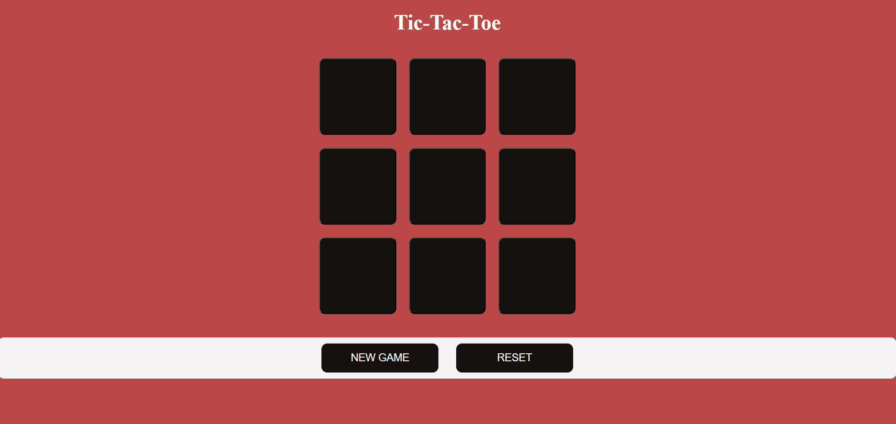
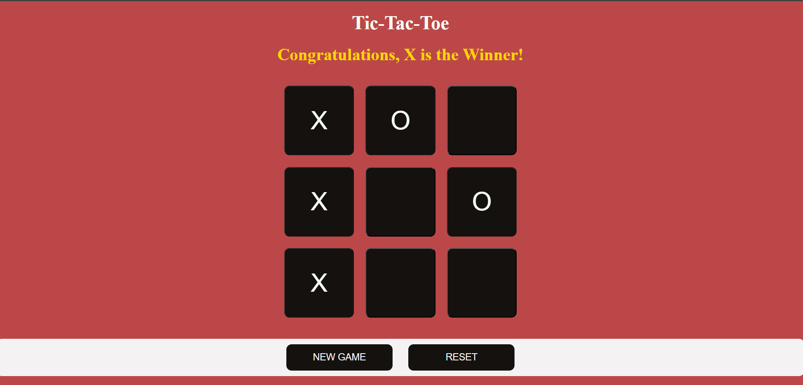

# tic_tac_toe
tic-tac-toe game as a mini-project (using HTML, CSS, JS)

# Author
Anika Varsha Shekar - @AnikaShekar

Built with
- HTML
- CSS
- JS

# Features
- winning pattern
  [[0,1,2],
  [3,4,5],
  [6,7,8],
  [0,3,6],
  [1,4,7],
  [2,5,8],
  [0,4,8],
  [2,4,6]]
- reset button - resets the game with the winner message
- new game button - resets the game without the winner message
- winner message - the winner name is diaplayed at the top

# Screenshots 

# Project Structure
├── index.html 
├── style.css 
│── screenshots/ 
│ ├── op1.png 
│ ├── op2.png 
└── README.md
